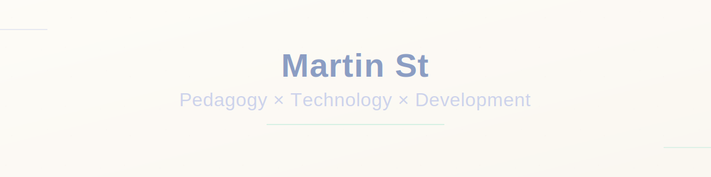

<div align="center">

<!-- Header Image with Canvas Background -->


<!-- LinkedIn Badge -->
<a href="https://www.linkedin.com/in/martin-stalder-787239216/">
  
</a>

</div>

<!-- Canvas Divider -->


## About Me

```yaml
name: Martin St
role: Educational Technology Specialist
focus_areas:
  - Pedagogy
  - Technology
  - Organizational Development
expertise: Shaping educational technology in pedagogically sound ways
approach: Intersection of teaching, tech innovation, and organizational growth
```

<!-- Canvas Divider -->


## Repositories

<!-- REPO-LIST:START -->
- [Praeto89](https://github.com/Praeto89/Praeto89) - GitHub Profile Repository
- [wochenplaner](https://github.com/Praeto89/wochenplaner) - Wochenplaner für Schüler und Lehrpersonen
- [PresentationTemplate](https://github.com/Praeto89/PresentationTemplate) - Interactive Reveal.js Presentation Framework
<!-- REPO-LIST:END -->

## Featured Project: PresentationTemplate

<div align="center">

<!-- TODO: Add screenshot when available -->
<!--  -->
**📚 [View Repository →](https://github.com/Praeto89/PresentationTemplate)**

</div>

**Interactive Reveal.js Presentation** with mindmap navigation and book-page design

A sophisticated presentation framework featuring:
- 3D book opening animation with zoom transitions
- Circular tile menu for topic navigation
- Mindmap-style sub-navigation with orbital childnodes
- Paper-like page design with typographic margins (Satzspiegel)
- Spiral zoom transitions with dynamic color themes
- Bookmark persistence for important subtopics
- Admin mode for live content editing

**Tech Stack:**
- JavaScript: 66.8%
- HTML: 18.8%
- CSS: 12.5%
- Other: 1.9%

<!-- Canvas Divider -->


## EdTech Platform Expertise

**Implementation Projects & Certifications:**

- **Lehreroffice** - Implementation projects, Superadmin certification
- **Pupil** - Implementation projects, Superadmin certification
- **Escola** - Implementation projects, Superadmin certification

Experience in rolling out educational technology solutions and providing advanced administrative support for school management systems.

<!-- Canvas Divider -->


## Tech Stack

<div align="center">

<!-- Programming Languages -->


<br><br>

<!-- EdTech Platforms -->


</div>

<!-- Canvas Divider -->


## Let's Connect

<div align="center">

**Interested in EdTech collaboration or organizational development projects?**

<a href="https://www.linkedin.com/in/martin-stalder-787239216/">
  
</a>

</div>

<!-- Canvas Divider -->


<div align="center">
  <sub>Built with passion for pedagogy and technology • Canvas design inspired by PresentationTemplate</sub>
</div>
