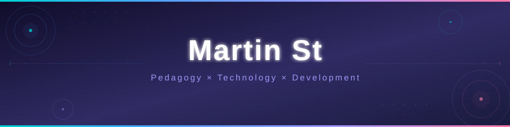
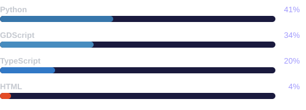

<div align="center">



<a href="https://educandus.ch">
  
</a>
<a href="https://www.linkedin.com/in/martin-stalder-787239216/">
  
</a>

</div>


## Über mich · About Me

```yaml
name: Martin Stalder
rolle: EdTech-Spezialist & Godot-Workshopleiter
schwerpunkte:
  - Game-Based Learning mit der Godot Engine (Gameatelier)
  - Pädagogik, Didaktik & inklusive Bildung
  - KI im Unterricht
  - EdTech-Einführung & -Administration
marke: Educandus – Dienstleistungen für Lehrpersonen
ansatz: Godot als kreatives Werkzeug zwischen Spiel, Logik und Lernen
```

> 🇬🇧 EdTech specialist and Godot workshop instructor from Switzerland. I run **[Educandus](https://educandus.ch)** (services for teachers, inclusive education) and teach game development as a pedagogical method — bridging play, logic, and learning.


## Gameatelier – Godot-Workshops

<div align="center">
  
  
</div>

<br>

**Game-Based Learning für Schulen & Bildungsinstitutionen**

Im Gameatelier entwickeln Schülerinnen und Schüler eigene Spiele mit der Godot Engine — vom ersten spielerischen Einstieg bis zum eigenen Mini-Game. Alle Workshops sind didaktisch klar strukturiert, am Lehrplan 21 orientiert und funktionieren auch in inklusiven Settings. Der reflektierte Einsatz von KI beim Lernen ist Teil des Konzepts.

| Workshop | Zielgruppe | Fokus |
|---|---|---|
| **Godot Basics** | Zyklus 2/3 (ab 5. Klasse) | Erste Schritte in der Spielentwicklung — ohne Programmier-Vorkenntnisse |
| **Game-Logik mit GDScript** | Sekundarstufe I (Zyklus 3) | Algorithmisches Denken, Variablen und Schleifen — spielerisch erarbeitet |
| **Godot für Lehrpersonen** | Lehrpersonen & Schulteams | Games als didaktische Methode — Integration in den eigenen Unterricht |

> **Workshop an Ihrer Schule oder Institution geplant?** [Anfrage über educandus.ch](https://educandus.ch) oder [LinkedIn](https://www.linkedin.com/in/martin-stalder-787239216/)

🇬🇧 *Game-based learning workshops for schools and educational institutions — from a first playful introduction to students building their own mini-game, aligned with the Swiss Lehrplan 21. Inclusive settings and the reflective use of AI are part of the concept.*

**Flaggschiff-Projekt · Flagship project:** [SobeGameStudios](https://github.com/Praeto89/SobeGameStudios) — ein offenes Godot-4-Lernprojekt (2D-Platformer) mit deutschsprachiger Dokumentation, Aufgaben, Debugging-Übungen («Bugchase») und automatisierten Tests. So sieht ein Workshop-Projekt in der Praxis aus.


## Educandus – Dienstleistungen für Lehrpersonen

Educandus ist meine pädagogische Marke: Beratung und Dienstleistungen für Lehrpersonen und Schulen — mit Fokus auf inklusive Bildung, Sonderpädagogik und den sinnvollen Einsatz von Technologie im Unterricht. Auf dem Blog schreibe ich über Schule, Inklusion und KI im Unterricht.

➡️ **[educandus.ch](https://educandus.ch)**

🇬🇧 *Educandus is my pedagogy brand: consulting and services for teachers and schools, focused on inclusive education, special needs education, and the meaningful use of technology in the classroom.*


## EdTech-Plattform-Expertise · EdTech Platform Expertise

**Einführungsprojekte & Zertifizierungen · Implementation projects & certifications:**

- **LehrerOffice** – Einführungsprojekte, Superadmin-Zertifizierung
- **Pupil** – Einführungsprojekte, Superadmin-Zertifizierung
- **Escola** – Einführungsprojekte, Superadmin-Zertifizierung

Erfahrung in der Einführung von EdTech-Lösungen und im erweiterten administrativen Support für Schulverwaltungssysteme.

🇬🇧 *Experience rolling out educational technology solutions and providing advanced administrative support for school management systems.*


## Tech Stack

<div align="center">


&nbsp;&nbsp;


<br><br>


</div>

### Sprachverteilung · Language Distribution

<div align="center">
  
</div>

<!-- LANG-STATS:START -->
- **Python:** 46%
- **GDScript:** 25%
- **TypeScript:** 23%
- **HTML:** 5%
- **GDShader:** 1%
<!-- LANG-STATS:END -->


## Repositories

<!-- REPO-LIST:START -->
- [SobeGameStudios](https://github.com/Praeto89/SobeGameStudios) - Godot workshop demo projects and teaching materials _(updated 2026-06-10)_
- [Praeto89](https://github.com/Praeto89/Praeto89) - GitHub profile – EdTech Specialist & Godot Workshop Instructor _(updated 2026-06-09)_
- [lp21games](https://github.com/Praeto89/lp21games) - Educational games for the LP21 curriculum _(updated 2026-03-18)_
- [wochenplaner](https://github.com/Praeto89/wochenplaner) - Wochenplaner für Schüler und Lehrpersonen.  _(updated 2026-01-26)_
<!-- REPO-LIST:END -->


## Contributions

<div align="center">
  
  <br><br>
  
</div>


## Kontakt · Let's Connect

<div align="center">

**Godot-Workshop an Ihrer Schule? Interesse an einer EdTech-Zusammenarbeit?**

🇬🇧 *Planning a Godot workshop at your school? Interested in EdTech collaboration?*

<a href="https://educandus.ch">
  
</a>
&nbsp;
<a href="https://www.linkedin.com/in/martin-stalder-787239216/">
  
</a>

</div>


<div align="center">
  <sub>Mit Leidenschaft für Pädagogik, Godot und Game-Based Learning · Built with passion for pedagogy, Godot, and game-based learning</sub>
</div>
